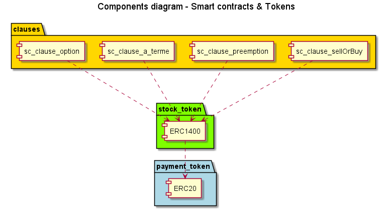
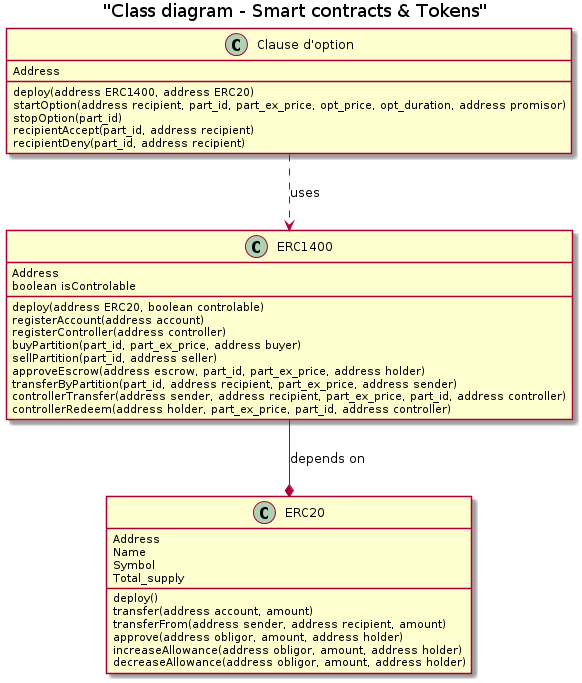
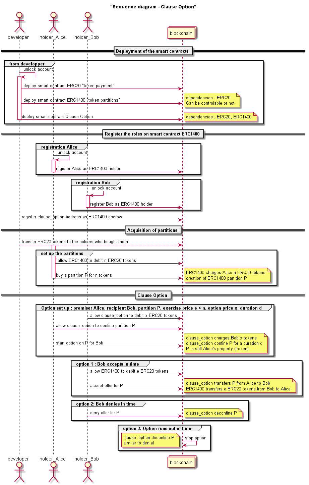

# open-clausier

## présentation des clauses

### clause à terme

### clause de préemption

### clause d'exclusion

### clause d'option

La clause d'option implique deux détenteurs de partitions, le prometteur et le bénéficiaire. Lorsqu'Alice (prometteuse) concède à Bob (bénéficiaire) un droit d'option sur l'une de ses partitions, elle accepte de "confiner" (geler) sa partition pendant un certain temps, la durée de l'option, pendant lequel Bob est invité à se positionner quant à l'acquisition de la partition d'Alice. Le droit d'option a un coût, en supplément du montant des partitions pouvant être transférées à Bob s'il décide d'acheter. Au delà de la durée de l'option, si Bob ne s'est pas prononcé, la partition est "déconfinée" et Alice peut en disposer à sa guise.

### clause sell or buy

## hypothèses de développement

Aucun token n'est créé. Les tokens sont gérés par le smart contract ERC20, accessible à tous les utilisateurs.
Le smart contract ERC1400 gère les actions (partitions) pour un groupe d'utilisateurs enregistrés (autorisés).
Les mouvements des token sont effectués sur le smart contract ERC20.
Les transfert, acquisition, vente, confinement de partitions sont effectués sur le smart contract ERC1400.

Pour mettre en oeuvre les clauses sous forme de smart contracts et permettre leur exécution automatique, un groupe d'utilisateurs doit être enregistré sur un smart contract ERC1400 représentant les actions de leur entreprise. Pour permettre l'acquisition d'actions, une méthode d'achat de partitions est implémentée. D'autres techniques d'acquisition de partitions pourront être mises en oeuvre selon les cas d'usage considérés.

Les smart contracts codant l'exécution automatique des clauses sont enregistrés avec le rôle "d'escrow" sur le smart contract ERC1400. Les utilisateurs lui délèguent la possibilité d'agir sur une de leur partition dans le cadre des méthodes définies dans le smart contract et pour un temps déterminé.

Nous avons fait le choix d'implémenter le séquestre d'une partition sous la forme d'un confinement. Cela présente l'avantage de conserver la partition sur le compte de son possesseur. En revanche, celui-ci ne peut pas agir dessus pendant la durée du confinement. C'est le smart contract "d'escrow" qui lève le séquestre, en déconfinant la partition lorsque les conditions de la clause sont réunies.

Les smart contracts sont déployés dans la blockchain une seule fois. Lorsqu'une clause est initiée, une transaction est envoyée vers la méthode permettant d'instancier la clause stipulant les parties prenantes, les partitions ciblées, les coûts et la durée.

Par convention, le développeur agit depuis le compte de portefeuille "account[0]".

## composants de la librairie

## diagramme de classes

## scénarios

### clause d'option

Le scénario mis en oeuvre pour effectuer le test de la clause d'option comporte les étapes préliminaires suivantes :

1) les smart contracts de tokens, de partitions et de la clause d'option sont déployés dans le ledger (la blockchain)
2) chaque acteur acquière des tokens de paiement (ERC20)
3) les membres de la société détenteurs de partitions s'enregistrent sur le smart contract ERC1400 gérant les partitions de leur entreprise
4) chacun des membres acquière quelques partitions
5) le smart contract de la clause d'option est enregistré comme "escrow" sur le smart contract ERC1400

Il s'agit ensuite de lancer un droit d'option : Alice initie un droit d'option en faveur de Bob sur l'une de ses partition (de numéro 1234) pour une durée de deux jours. Le coût de l'option est de 1 token ERC20, et le coût de l'exercice est de 3 tokens, supérieur (ou égal) au montant de la partition de 2 tokens. Pour cela :

5) Bob positionne sur le smart contract de paiement (ERC20) son accord pour être débité d'un token par le smart contract de la clause d'option
6) Alice positionne son accord sur le smart contract de partitions (ERC1400) pour l'autoriser à modifier le status de sa partition de numéro 1234
7) Alice lance le droit d'option en faveur de Bob par le déclenchement d'une méthode du smart contract d'option. cela a pour effet de mettre sa partition de numéro 1234 en "confinement" pour la durée de l'option sur le smart contract ERC1400, et de débiter le compte de Bob de un token au profit d'Alice sur le smart contract de paiement (ERC20).

Dans la durée de l'option, Bob accepte l'achat de la partition numéro 1234. Pour cela :
8) Bob positionne son accord sur le smart contract de paiement (ERC20) autorisant le smart contract de partitions à débiter son compte du montant de l'exercice.
9) Puis, il indique sa décision d'acquérir la partition de numéro 1234 sur le smart contract d'option. Cela a pour effet d'effectuer le transfert de la partition de numéro 1234 d'Alice vers Bob sur le smart contract ERC1400, cette partition étant automatiquement "déconfinée", et de transférer 3 tokens correspondant au prix de l'exercice du compte de Bob vers le compte d'Alice sur le smart contract de paiement ERC20.

Dans la suite, Alice lance un autre droit d'option en faveur de Bob sur sa partition de numéro 5678. La durée de l'option est de 5 jours, le coût de l'option est de un token et le montant de l'exercice de 3 tokens est égal au montant de la partition. Pour cela :

10) Bob positionne sur le smart contract de paiement (ERC20) son accord pour être débité d'un token par le smart contract de la clause d'option
11) Alice positionne son accord sur le smart contract de partitions (ERC1400) pour l'autoriser à modifier le status de sa partition de numéro 5678
12) Alice lance le droit d'option en faveur de Bob par le déclenchement d'une méthode du smart contract d'option. Cela a pour effet de mettre sa partition de numéro 5678 en "confinement" pour la durée de l'option sur le smart contract ERC1400, et de débiter le compte de Bob de un token au profit d'Alice sur le smart contract de paiement (ERC20).

Dans la durée de l'option, Bob refuse l'achat de la partition numéro 5678. Pour cela :

13) Il indique son refus sur le smart contract de la clause d'option, ce qui a pour effet de "déconfiner" la partition de numéro 5678 sur le compte d'Alice.

La séquence des opérations est illustrée sur le diagramme suivant :

