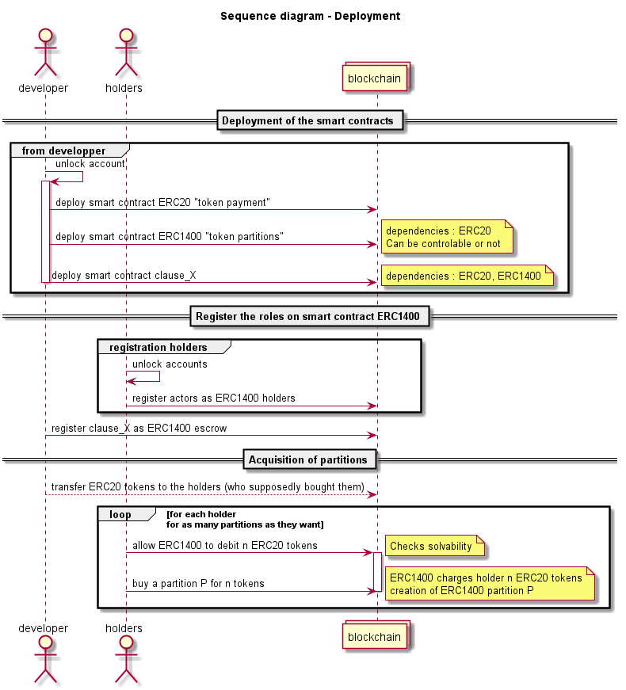

# Open clauses

Dans le cadre de ce projet, différentes clauses juridiques implémentées à l'aide de smart contracts sur la blockchain *Ethereum* sont soumises à une série de tests fonctionnels dans le but de s'assurer du bon fonctionnement de ces clauses en interraction les unes avec les autres.

Pour cette phase de test, la blockchain *Ethereum* est simulée par le module *python* open source *[ganache-cli](https://github.com/trufflesuite/ganache-cli)*.

L'environnement de compilation, d'exécution et de test est géré par le module *python* open source *[brownie](https://github.com/eth-brownie/brownie)*.

## Présentation des clauses

Avant d'entrer dans la partie technique du sujet, le fonctionnement et le cas d'usage des clauses qui vont être testées sont succintement preésentés ci-dessous.

### Clause d'option

La clause d'option implique deux acteurs, le détenteur de la partition (Alice) et le bénéficiaire (Bob). Lorsqu'Alice accorde à Bob un droit d'option sur l'une de ses partitions, elle accepte de geler sa partition pendant un certain temps, la durée de l'option, pendant lequel Bob est invité à se positionner quant à l'acquisition de la partition d'Alice. Le droit d'option a un coût, en supplément du montant des partitions pouvant être transférées à Bob s'il décide d'acheter. Au delà de la durée de l'option, si Bob ne s'est pas prononcé, la partition est dégelée et Alice peut en disposer à sa guise.

### Clause de vente à terme

La clause de vente à terme implique deux acteurs, le détenteur de la partition (Alice) et le bénéficiaire (Bob). Lorsqu'Alice accorde à Bob un droit de vente à terme sur l'une de ses partitions, elle accepte de geler sa partition pendant un certain temps, la durée avant le terme, durée après la quelle Bob est libre d'acheter la partition à Alice pour son prix d'exercice plus un surcoût fixé au moment de l'émission du droit de vente (typiquement en prévision d'une augmentation de la valeur de l'action). La partition est alors transférée d'Alice à Bob contre la somme prévue. Si Bob refuse de terminer la vente après le terme, Alice garde sa partition qui est dégélée ainsi que le surcoût promis par Bob.

### Clause de préemption

La clause de préemption implique deux acteurs ou plus et prend réellement son sens à partir de trois acteurs, un détenteur d'une partition (Alice) souhaitant vendre son action et des acheteurs potentiels (ici Bob et Charles). La clause de préemption permet à Alice d'émettre un avis de vente à destination des acheteurs potentiels qu'elle souhaite pour une partition qu'elle possède (qui est alors gelée), les potentiels acheteurs peuvent ensuite indiquer leur volonté d'acheter ou non la partition au prix demandé dans le temps imparti fixé par Alice. Une fois leur réponse donnée, Alice choisit à sa discrétion l'acheteur à qui elle vend effectivement la partition, parmis ceux ayant donné une réponse positive. La partition est alors dégelée et tranférée à l'acheteur choisi contre la somme prévue en token de paiement *ERC20*.

### Clause sell or buy

La clause sell or buy implique deux acteurs (toujours Alice et Bob), tous deux détenteurs de la même valeur d'actions, c'est à dire que les valeurs cumulées en tokens de paiement ERC20 des partitions *ERC1400* de chacun sont égales. La clause sell or buy est utile lorsqu'Alice et Bob ne peuvent plus continuer à partager la propriété des actions en question, Alice peut alors faire appel à cette clause pour émettre un avis d'achat ou vente portant sur la totalité de ses actions à destination de Bob, valable pour une durée donnée et au prix d'exercice de son choix supérieur à la valeur des partitions. Bob peut alors accepter l'offre et vendre à Alice la totalité de ses partitions au prix proposé, au contraire si Bob refuse l'offre ou s'abstient de répondre dans les délais il est contraint d'acheter la totalité des partitions d'Alice au prix initialement proposé par cette dernière.

## Hypothèses de développement

Aucun token n'est créé. Lors de la phase d'initialisation, les utilisateurs se voient créditer des tokens de paiement qui correspondraient à un investissement de leur part mais qui, dans notre cas, sont fictifs.

Les tokens sont gérés par le smart contract *ERC20*, accessible à tous les utilisateurs.

Le smart contract *ERC1400* gère les actions (partitions) pour un groupe d'utilisateurs enregistrés.

Les mouvements des token sont effectués sur le smart contract *ERC20*.

Les transferts, acquisitions, ventes, et gels de partitions sont effectués sur le smart contract *ERC1400*.

Pour mettre en oeuvre les clauses sous forme de smart contracts et permettre leur exécution automatique, un groupe d'utilisateurs doit être enregistré sur un smart contract de partitions *ERC1400* représentant les actions de leur entreprise. Pour permettre l'acquisition d'actions, une méthode d'achat de partitions est implémentée. D'autres techniques d'acquisition de partitions pourront être mises en oeuvre selon les cas d'usage considérés.

Les smart contracts qui codent l'exécution automatique des clauses sont enregistrés avec le rôle d'*escrow* sur le smart contract *ERC1400*. Les utilisateurs lui délèguent la possibilité d'agir sur une de leur partition dans le cadre des méthodes définies dans le smart contract et pour un temps déterminé.

Nous avons fait le choix d'implémenter le séquestre d'une partition sous la forme d'un gel. Cela présente l'avantage de conserver la partition sur le compte de son possesseur. En revanche, celui-ci ne peut pas agir dessus pendant la durée du gel. C'est le smart contract d'*escrow* qui lève le séquestre, en dégelant la partition lorsque les conditions de la clause sont réunies.

Les smart contracts sont déployés dans la blockchain une seule fois. Lorsqu'une clause est initiée, une transaction est envoyée vers la méthode permettant d'instancier la clause stipulant les parties prenantes, les partitions ciblées, les coûts et la durée.

Par convention, le développeur agit depuis le compte de portefeuille `account[0]`.

## Composants de la librairie

La librairie de smart contract est composée :
- D'un smart contract de tokens de paiement, *ERC20*
- D'un smart contract de tokens de partitions, *ERC1400*, qui dépend du token de paiement
- D'un smart contract par clause qui dépend des deux smart contracts de tokens prédents

Le diagramme suivant représente l'organisation de la librairie :

  

## Tests fonctionnels

### Déploiement des smart contracts

Les scénarios mis en oeuvre pour effectuer les tests des différentes clauses comportent tous les étapes préliminaires suivantes :

1. Les comptes utilisateurs (généralement Alice et Bob) et developper sont déclarés et chargés depuis le simulateur *ganache-cli*.
2. Les smart contracts de tokens (*ERC20*), de partitions (*ERC1400*) et de la clause à tester sont déployés dans la blockchain simulée par *ganache-cli*.
3. Chaque acteur acquière des tokens de paiement *ERC20*.
4. Les acteurs amenés à détenir des partitions s'enregistrent en tant que *holders* sur le smart contract de partition *ERC1400*.
5. Le smart contract de la clause à tester est enregistré comme *escrow* par le smart contract de partition *ERC1400*.
6. Les acteurs souhaitant investir dans des partitions positionnent les autorisations nécessaires au débit de tokens de paiement *ERC20* correspondant.
7. Les acteurs enregistrés investissent dans les partitions souhaitées (dans notre cas les partitions utiles aux tests).

La séquence des opérations est illustrée par le diagramme suivant :

  

Au cours de ces phases d'initialisation sont testées les différentes méthodes de ces smart contracts utiles au déploiement, à l'enregistrement des rôles par les smart contracts, au positionnement d'autorisations et à l'achat et transfer de tokens. A partir de valeurs données, ces tests vérifient que le comportement du système et l'état des variables concernées sont bien ceux attendus.

### Clause d'option

Alice est détentrice d'une partition `P` sur laquelle Bob souhaite mettre une option pour l'acheter au prix d'exercice `e` supérieur à la valeur `n` de la partition, l'option à un coût `x` et est valable pour une durée `d`.

#### Déclaration du droit d'option

1. Bob autorise le smart contract *clause_option* à le débiter de `x` tokens de paiement *ERC20*.
2. Alice autorise le smart contract *clause_option* à séquestrer sa partition `P`.
3. Alice lance le droit d'option à destination de Bob, sa partition `P` est alors gelée pour la durée `d` de l'option et Bob est débité du coût `x` de l'option au profit d'Alice sur le smart contract de paiement *ERC20*. Alice est toujours propriétaire de la partition mais ne peut en disposer.

#### Résolution de l'option

##### Bob accepte dans le temps imparti

Si Bob souhaite accepter l'offre d'Alice, il doit au préalable autoriser le smart contract de partitions *ERC1400* à le débiter du prix `e` de la partition en tokens de paiement *ERC20*.

Il indique ensuite au smart contract *clause_option* sa décision d'acquérir la partition `P`, le tout avant que la durée `d` de l'option ne soit écoulée. La partition `P` est alors dégélée et transférée de Alice à Bob, Bob lui est débité du prix `e` de la partition en token de paiement *ERC20* au profit d'Alice.

##### Bob refuse dans le temps imparti

Si Bob ne souhaite pas accepter l'offre d'Alice, il indique simplement au smart contract *clause_option* son refus dans le temps imparti `d`, le droit d'option est alors levé et Alice reste propriétaire de la partition `P` qui est dégelée.

##### L'option expire

Si Bob reste indécis trop longtemps et n'indique pas son choix avant que la durée `d` de l'option ne soit écoulée, le droit d'option est levé et Alice peut à nouveau disposer de sa partition comme en cas de refus.

La séquence des opérations est illustrée par le diagramme suivant :

  

Au cours de ce déroulement, chaque cas de figure est testé afin de s'assurer que les smart contracts gèrent les différentes possibilités comme ils le doivent et que chaque étape intermédiaire fonctionne correctement.

### Clause à terme

Alice est détentrice d'une partition `P` que Bob souhaite acheter après une durée `d` au prix d'exercice `e` supérieur à la valeur `n` de la partition, avec un surcoût de `x` au terme.

#### Déclaration du droit de vente

1. Bob autorise le smart contract *clause_forward* à le débiter de `x` tokens de paiement *ERC20*.
2. Alice autorise le smart contract *clause_forward* à séquestrer sa partition `P`.
3. Alice lance le droit de vente à terme à destination de Bob, sa partition `P` est alors gelée pour la durée `d` et Bob est débité du surcoût `x` de la vente au profit d'Alice sur le smart contract de paiement *ERC20*. Alice est toujours propriétaire de la partition mais ne peut en disposer.

#### Résolution de la vente

Après écoulement de la durée prévue, Bob choisi de terminer ou non la vente.

##### Bob accepte

Si Bob souhaite toujours conclure la vente et acheter la partition `P`, il doit au préalable autoriser le smart contract *ERC1400* à le débiter de `e` tokens de paiement *ERC20*. Il indique ensuite au smart contract *clause_forward* sont intention de conclure la vente, la partition est alors transférée de Alice à Bob et dégelée, et Bob est débité de `e` tokens de paiement au profit d'Alice.

##### Bob refuse

Si Bob ne juge plus intéressant de conclure la vente une fois le terme dépassé, il peut annuler la vente. Il indique donc sa sécision au smart contract clause_forward. Alice peut alors disposer à nouveau de la partition `P` et Bob ne récupère pas le surcoût `x` versé à Alice.

La séquence des opérations en cas de vente est illustrée par le diagramme suivant :

  

Au cours de ce scénario sont testées les méthodes permettant l'émission du droit de vente et la vente de l'action elle-même conformément aux différentes valeurs spécifiées.

### Clause de préemption

Alice est détentrice d'une partition `P` de valeur `n` qu'elle souhaite vendre à Bob ou Charles avec un surcoût de préemption `x` dans un délai `d`.

#### Emission de l'avis de vente

1. Alice autorise le smart contract *clause_preemption* à séquestrer sa partition `P`.
2. Alice enregistre Bob et Charles en tant que destinataires potentiels des avis de vente qu'elle emettra pendant une durée `D`.
3. Dans la période fixée `D`, Alice crée les avis de vente pour `P` valables pour la durée `d` à destination de Bob et Charles, avec un coût de préemption `x`. Sa partition est alors gelée.

#### Réponses des destinataires

Bob souhaite acheter la partition `P` mise en vente par Alice, pour cela il doit :

1. Autoriser le smart contract *clause_preemption* à le débiter de `x` tokens de paiement *ERC20*.
2. Autoriser le smart contract de partitions *ERC1400* à le débiter de `n` tokens de paiement.
3. Informer le smart contract *clause_preemption* de sa volonté d'acheter `P` dans le temps imparti `d`.

Charles lui n'est pas intéressé par l'avis de vente, il lui suffit donc d'informer le smart contract *clause_preemption* de sa décision ou simplement ingorer l'offre.

#### Décision d'Alice & vente

Lorsqu'au moins un destinataire de l'avis de vente s'est prononcé intéressé par l'achat de la partition `P`, Alice peut choisir parmis eux celui à qui elle souhaite effectivement vendre. Dans notre scénario seul Bob est intéressé par `P` au prix demandé, Alice informe donc le smart contract *clause_preemption* de sa décision de vendre `P` à Bob. La partition `P` est alors transférée d'Alice à Bob contre `n + x` tokens de paiement *ERC20*.

La séquence des opérations est illustrée par le diagramme suivant :

  

Les tests exécutés aux différentes étapes de ce scénario permettent de s'assurer du bon déroulement de la vente avec du positionnement des acteurs par rapport à l'offre d'Alice.

### Clause sell or buy

Alice et Bob sont chacun détenteurs d'un ensemble de partitions de valeur totale `n`. Alice fait une proposition valable pour une durée `d` portant sur la totalité des partitions pour un surcoût `x` donc au prix d'exercice `n + x = e > n`.

#### Emission de l'avis d'achat ou vente

1. Alice autorise le smart contract *clause_sell_or_buy* à geler l'ensemble de ses partitions.
2. Alice autorise le smart contract *clause_sell_or_buy* à la débiter de `x` tokens de paiement *ERC20*.
3. Alice autorise le smart contract *ERC1400* à la débiter de `n` tokens de paiement.
4. Alice lance l'avis de vente ou achat pour l'ensemble des partitions à destination de Bob au prix d'exercice `e` pour la durée `d`.

#### Résolution de la vente

Bob choisit d'accepter l'offre et vendre ou de refuser et acheter dans le temps imparti, ou bien il doit acheter.

##### Bob accepte et vend

1. Bob autorise le smart contract *clause_sell_or_buy* à geler l'ensemble de ses partitions.
2. Bob informe le smart contract *clause_sell_or_buy* dans le délai `d` de sa volonté d'accepter l'offre d'Alice. Ses partitions sont alors transférées en totalité à Alice qui verse à Bob le montant de `e` tokens de paiement *ERC20*.

##### Bob refuse et achète

1. Bob autorise le smart contract *clause_sell_or_buy* à le débiter de `x` tokens de paiement *ERC20*.
2. Bob autorise le smart contract *ERC1400* à le débiter de `n` tokens de paiement.
3. Bob informe le smart contract *clause_sell_or_buy* dans le délai `d` de sa volonté de refuser l'offre d'Alice. La totalité des partitions d'Alice est alors transférée à Bob pour le prix d'exercice proposé `e` qui revient à Alice.

##### Le délai est dépassé ou un litige entre les acteurs empèche la conclusion de la vente

Dans ce cas une tierce partie virtuelle ou non, le *controller*, peut forcer la vente des actions de l'un ou l'autre des acteurs sans que ces derniers ai nécessairement donné leur autorisation aux smart contracts utilisés (décision judiciaire, etc).

La séquence des opérations est illustrée par le diagramme suivant :

  

Au cours de ce déroulement, chaque cas de figure est testé afin de s'assurer que les smart contracts gèrent les différentes possibilités comme ils le doivent et que chaque étape intermédiaire fonctionne correctement, de l'émission de l'avis d'achat ou vente au transfer de partitions et tokens de paiement.

## Perspectives

Cette batterie de tests fonctionnels est un outil efficace pour s'assurer que les scénarios typiques d'utilisation des différentes clauses de la librairie se déroulent correctement, elle gagnerait à être enrichie par des tests de sécurité. L'ajout aux différentes étapes de ces scénarios de tests vérifiant le bon fonctionnement des *requirements* permettrait d'assurer la robustesse des différentes méthodes des smart contracts d'un point de vue fonctionnel. 

